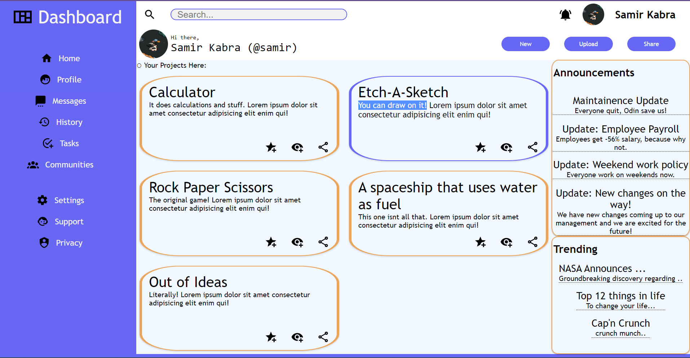

# admin-dashboard
### A simple admin dashboard page made using HTML/CSS, an exercise for [TheOdinProject](theodinproject.com)
#### Click on the picture/the link below to try!

## [Click to open](https://redplusblue.github.io/admin-dashboard/)

## What I used/learned: 
1. HTML
2. CSS: Grid, Flexbox
